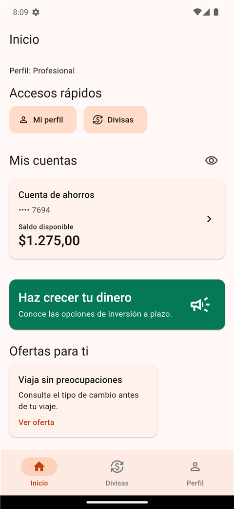
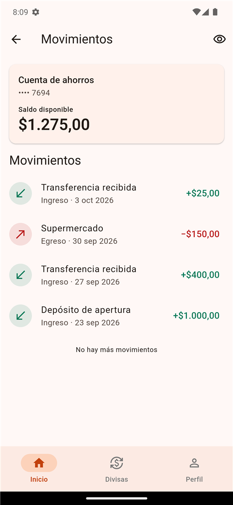
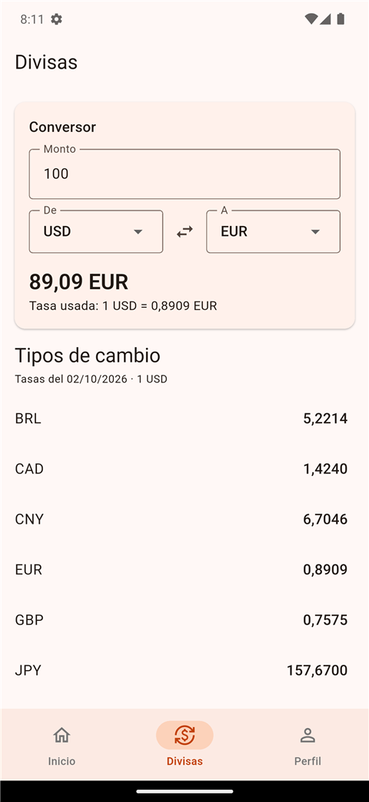
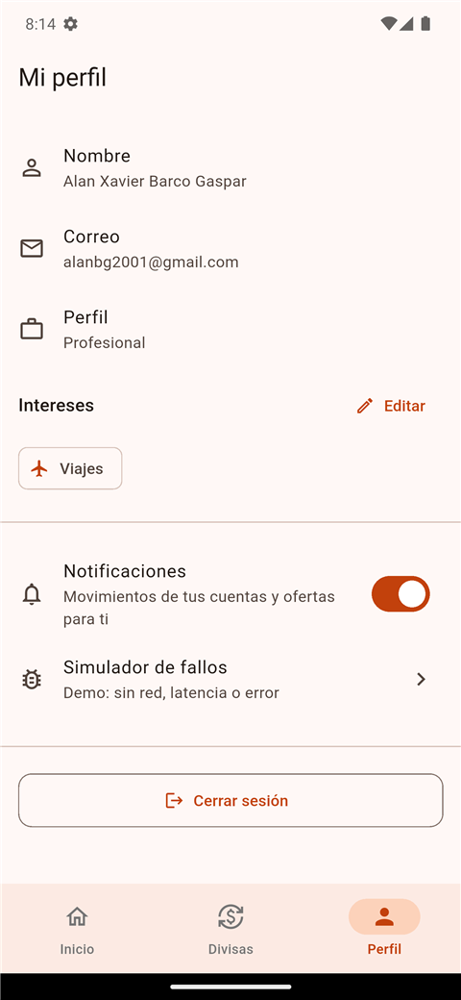
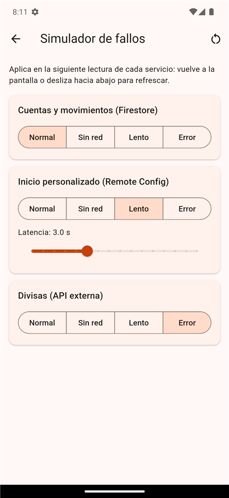
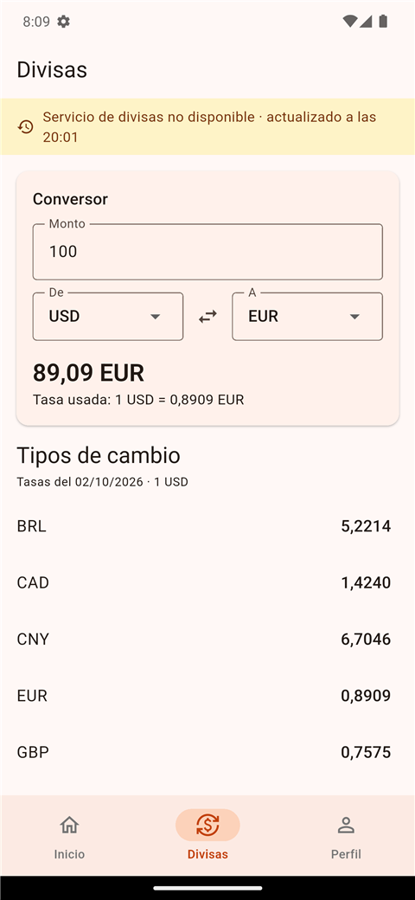
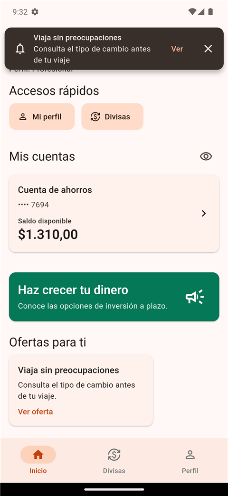
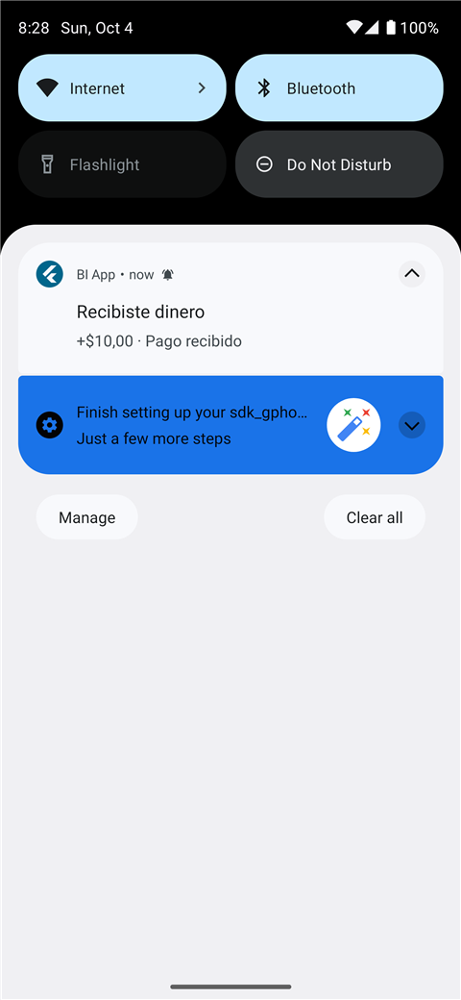
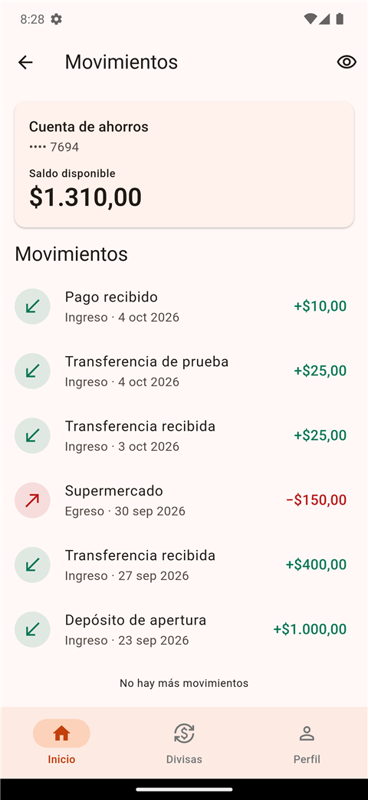

# BI App

MVP de banca móvil 100 % digital y personalizada, construido con **Flutter + Firebase** (plan
Spark, costo cero).

[](https://github.com/alanbarco/banca-movil/actions/workflows/ci.yml)

## Qué hace

| Capacidad | Cómo |
|---|---|
| **Onboarding y autenticación** | Registro con segmento e intereses, cuenta de ahorros creada al instante, login, recuperación de contraseña, cierre por inactividad |
| **Cuentas y movimientos** | Saldos y movimientos **en tiempo real** (Firestore), paginación, ocultar saldos |
| **Personalización dinámica** | Inicio **Server-Driven UI** desde Remote Config: layout, ofertas y funcionalidades por segmento e intereses, cambios sin publicar la app |
| **Servicio externo** | Tipos de cambio (API Frankfurter) con conversor, reintentos y caché |
| **Notificaciones push** | FCM por segmento y por cliente, aviso in-app y apertura de la pantalla relacionada |
| **Resiliencia** | Offline-first, datos desactualizados con su hora, reintentos, recuperación automática y un **simulador de fallos** para la demo |
| **Observabilidad** | Crashlytics + Analytics con catálogo de eventos sin PII |

## Capturas

| Inicio personalizado | Cuenta en tiempo real | Divisas |
|---|---|---|
|  |  |  |

| Perfil y preferencias | Simulador de fallos | Divisas con el servicio caído |
|---|---|---|
|  |  |  |

| Push con la app abierta (por segmento) | Push con la app en segundo plano | Al tocarla: el movimiento nuevo |
|---|---|---|
|  |  |  |

## Requisitos

- Flutter **3.35.4** (Dart 3.9) · Android Studio con emulador **API 33+ con Google Play** o un
  dispositivo Android
- Node.js 20+ y Firebase CLI (configuración y herramientas del banco)
- Un proyecto de Firebase en plan Spark

## Configurar

Guía completa: [quickstart.md](specs/001-digital-banking-mvp/quickstart.md). En resumen:

1. Descargar `google-services.json` de la app Android `com.alanbarco.bi_app` a `android/app/`.
2. Copiar `.env.example` a `.env` y completar las claves de Firebase. `DEMO_TOOLS=true`
   habilita el simulador de fallos.
3. Desplegar la configuración versionada:
   ```bash
   firebase deploy --only firestore:rules,firestore:indexes,remoteconfig
   ```

Ninguna credencial está en el repositorio (`.env`, `google-services.json` y
`tools/admin/service-account.json` están en `.gitignore`).

## Ejecutar

```bash
flutter pub get
flutter run --dart-define-from-file=.env
```

## Probar

```bash
dart format --output=none --set-exit-if-changed .
flutter analyze
flutter test --coverage               # unit + BLoC + widget
dart run tool/check_coverage.dart     # umbral: 70 % en domain y BLoCs
flutter test integration_test/critical_flow_test.dart -d <emulador> --dart-define-from-file=.env
```

El E2E crea un cliente real (`e2e+<timestamp>@example.com`), verifica la cuenta con saldo en
el inicio y al menos 3 movimientos en el detalle. CI ejecuta todo lo anterior salvo el E2E y
además compila el APK.

## Estructura

```
lib/
├── app/            composición: arranque, DI, router, shell
├── core/           contratos compartidos, SDUI, flags, resiliencia, observabilidad, UI
└── features/       un dominio cada una: domain / data / presentation
    ├── auth/  accounts/  personalization/  fx/  notifications/
test/               espejo de lib/ (unit, BLoC, widget)
integration_test/   E2E crítico
firebase/           reglas, índices y Remote Config como código
tools/admin/        scripts del "banco" (movimientos, push)
docs/               arquitectura, ADRs, operación, uso de IA
specs/              especificación, plan, contratos y tareas
```

## Cómo se diseñó

- [Arquitectura](docs/architecture.md): componentes, dependencias, flujos, supuestos, riesgos
  y escalamiento.
- [Decisiones (ADRs)](docs/adr/): backend, onboarding, SDUI, servicio externo, resiliencia,
  modularidad.
- [Despliegue y operación](docs/operations.md): monitoreo, detección de problemas,
  comportamiento degradado y runbook.
- [Uso de IA](docs/ai-usage.md): herramientas, flujo, ejemplos e impacto.
- [Especificación y plan](specs/001-digital-banking-mvp/) y la
  [constitución](.specify/memory/constitution.md) del proyecto.

## Colaborar

- **Trunk Based Development**: commits pequeños directamente en `main`, siempre en verde.
  Cada cambio pasa los mismos gates que CI antes del commit; las funcionalidades incompletas
  o riesgosas se protegen con feature flags de Remote Config en lugar de ramas largas.
- **Conventional Commits**: `feat(scope): …`, `fix(scope): …`, `docs: …`, `refactor: …`,
  `test: …`, `chore: …`. El scope es la feature o capa (`auth`, `accounts`, `fx`, `core`…).
- Reglas de arquitectura: sin imports entre features, `domain` en Dart puro y casos de uso
  solo cuando hay lógica ([ADR-006](docs/adr/006-feature-first-to-packages.md)).
