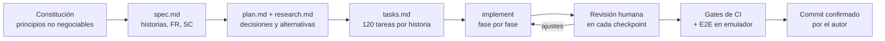

# Uso de herramientas de IA

## 1. Herramientas

| Herramienta | Para qué |
|---|---|
| **Claude Code** (CLI y extensión de VS Code) | Especificación, implementación, revisión, depuración en el emulador (adb, logcat, capturas), documentación |
| **Spec Kit** (`/speckit-*`) | Flujo de desarrollo dirigido por especificación: constitución → spec → plan → tasks → implement |
| GitHub Actions | Verificación automática de todo lo generado (formato, análisis, tests, cobertura, build) |

## 2. Flujo de trabajo

- **Constitución** ([`.specify/memory/constitution.md`](../.specify/memory/constitution.md)):
  ocho principios (Clean Architecture feature-first, BLoC, SDUI, resiliencia, pruebas,
  seguridad, costo cero, decisiones documentadas) que la IA debía respetar en cada tarea.
- **Spec y contratos** ([`specs/001-digital-banking-mvp/`](../specs/001-digital-banking-mvp/)):
  se escribieron antes del código; los contratos (Remote Config, push, reglas, API externa,
  eventos) son la referencia contra la que se revisa la implementación.
- **Implementación por historias de usuario**, con una parada obligatoria al final de cada
  fase para revisión humana antes de hacer commit.
- **Reglas de trabajo**: la IA no hace commit sin que el autor confirme archivos y mensaje;
  antes de cada commit se ejecutan los mismos gates que CI.
- **Rol del autor**: dirige y supervisa. Define los requerimientos y las reglas de
  arquitectura, revisa cada cambio, exige que la IA justifique sus decisiones con diagramas
  y prueba cada historia en el emulador; la IA implementa dentro de ese marco.

## 3. Ejemplos concretos

### Decisiones del autor que cambiaron lo que propuso la IA

| Propuesta de la IA | Decisión del autor | Resultado |
|---|---|---|
| Un caso de uso por cada acción, aunque solo reenviara al repositorio | "Solo crea casos de uso cuando hay lógica" | Se eliminaron 6 clases; los BLoCs usan la interfaz del repositorio |
| Banner "sin conexión" al primer dato de caché | Mostrarlo solo sin red o si pasan 5 s sin el servidor | `StaleDataGate`; adiós al parpadeo al abrir una pantalla |
| `resolve_home_layout.dart` compacto | "Es ilegible" | Reescrito en 3 pasos con nombres explícitos |
| Nombre `sl` para el service locator | Renombrar a `getIt` | Más claro para quien llega al código |
| Spinner solo mientras Firebase Auth valida | "Parece congelado" | El botón sigue cargando hasta que la app navega |
| "Error" del simulador en Firestore lanzaba una excepción | Exigir que se comporte como el SDK y use la caché | Ahora imita al SDK ante un 503: responde desde la caché |

### Errores de la IA detectados por verificación

| Error | Cómo se detectó |
|---|---|
| Un `async*` que se colgaba al cancelar la suscripción | Test que no terminaba; se reprodujo aislado y se reescribió con `StreamController` |
| El cierre de sesión no esperaba a borrar el token de push (se haría sin credenciales) | Revisión del flujo al implementar US5; ahora `signOut` espera las limpiezas |
| Un dispositivo nuevo nunca pedía el permiso de push si la cuenta ya las tenía activadas | Prueba en un emulador nuevo: no aparecía el token |
| Un estado tipado como `LoadState<Never>` en lugar de `LoadState<T>` | Test nuevo que falló por tipos |
| Skeleton infinito con caché vacía y servidor caído | El autor lo vio en el simulador de fallos |
| Un archivo sin formatear rompió el CI tras un push | CI; desde entonces el formato se verifica antes de cada commit |

### Diagnóstico asistido

- **App colgada en el splash**: la IA leyó la salida de `flutter run` y vio que el token de la
  URL del VM service no cambiaba entre intentos: la herramienta leía una dirección vieja del
  log del emulador. Solución: limpiar `logcat` y las redirecciones de `adb`.
- **Push sin token**: en `logcat`, `AUTHENTICATION_FAILED` afectaba a todo Play Services del
  emulador API 36, no a la app. Se confirmó con un emulador API 33, donde funcionó.

## 4. Impacto

| Área | Impacto observado |
|---|---|
| **Productividad** | Cinco historias de usuario, simulador de fallos, herramientas admin y documentación en dos días, con 65+ commits pequeños en `main` |
| **Calidad** | La constitución y los contratos dieron criterios explícitos para revisar cada cambio; los bugs de la tabla anterior se encontraron antes de publicar |
| **Pruebas** | Tests unitarios, de BLoC, de widgets y E2E escritos junto con cada historia: más de 370 tests y cobertura cercana al 96 % en `domain` y BLoCs (umbral de CI: 70 %) |
| **Documentación** | Spec, plan, contratos, ADRs y diagramas se mantuvieron al día con el código porque se generaron en el mismo flujo |

No se midió un grupo de control; el impacto en tiempo es una estimación del autor, no una
métrica.

## 5. Límites y verificaciones humanas

- **Nada se acepta sin verificar**: cada cambio pasa formato, análisis estático, tests y umbral
  de cobertura, localmente y en CI. Los flujos críticos se prueban además en el emulador.
- **La IA no conoce el estado real del entorno**: emuladores, consola de Firebase, Play
  Services. Esos problemas se resolvieron leyendo logs reales, no suponiendo.
- **La IA tiende a sobrediseñar**: casos de uso que solo reenvían, abstracciones prematuras.
  El autor recortó donde no había valor.
- **Revisión crítica**: el autor revisó cada pieza (inyección de dependencias, streams,
  go_router, SDUI, caché, push) y rechazó o corrigió las decisiones que no se justificaban;
  varias de la tabla de la sección 3 salieron de esa revisión.
- **Seguridad**: la IA no recibe secretos; la cuenta de servicio y `.env` no se versionan.
