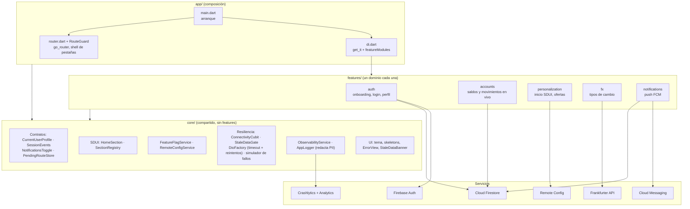
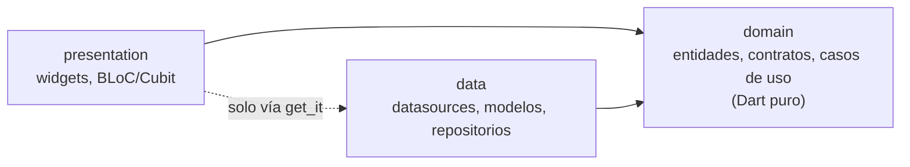
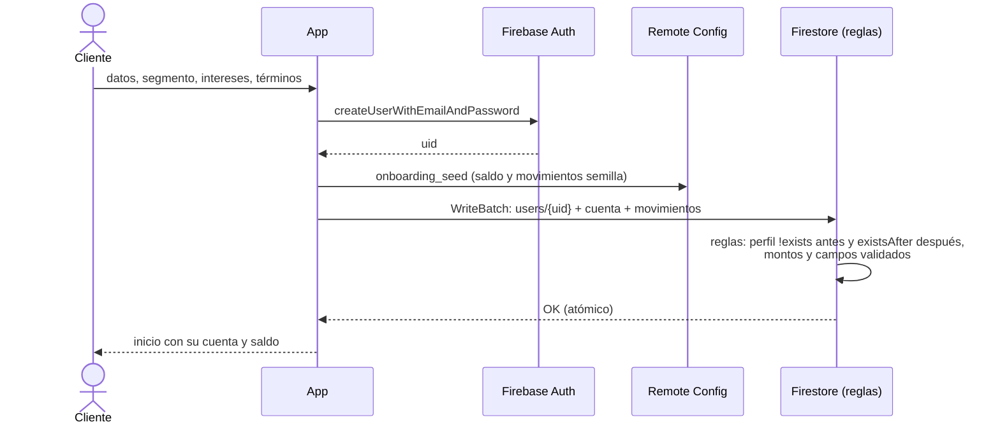
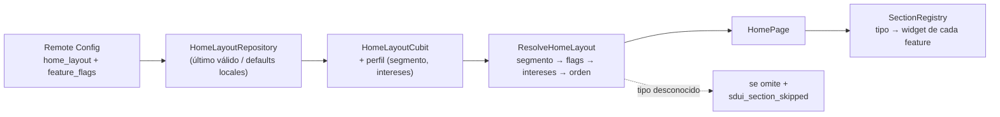
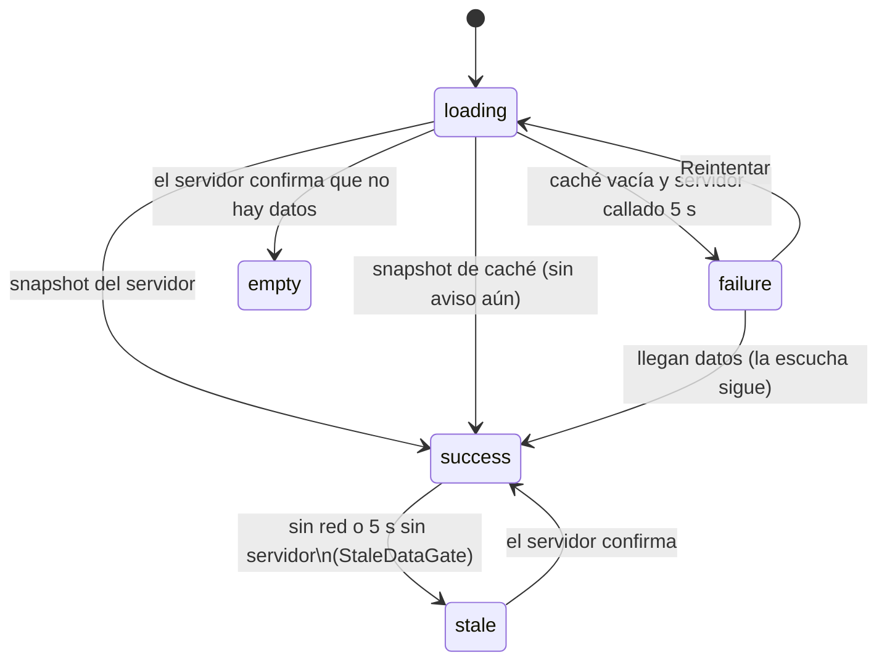
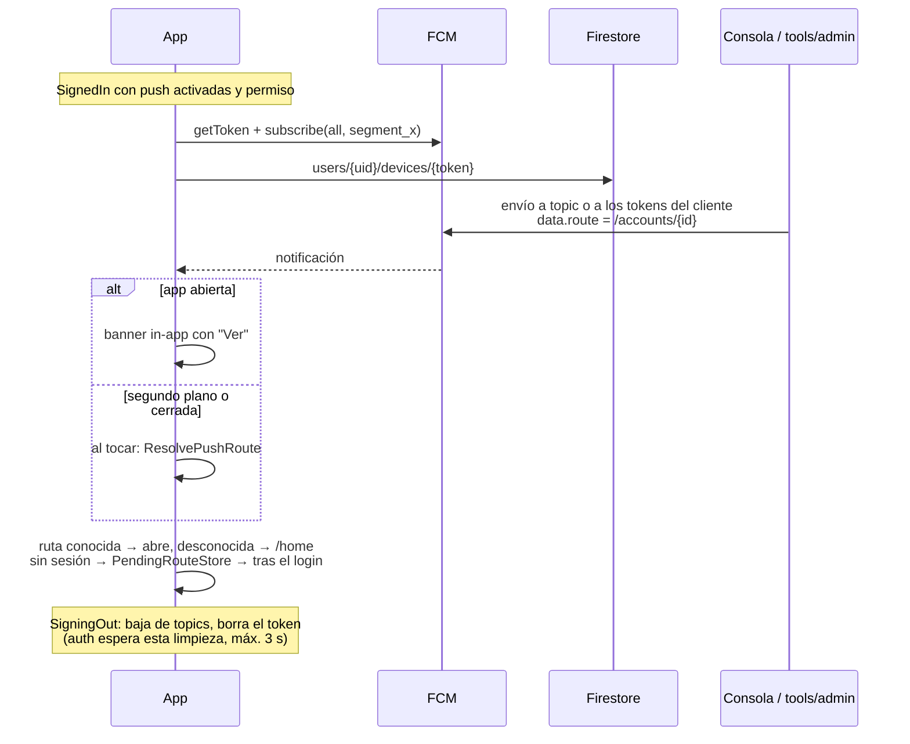

# Arquitectura

App Flutter única, organizada **feature-first** con Clean Architecture, sobre Firebase (plan
Spark). Las decisiones y sus alternativas están en los [ADRs](adr/); el detalle funcional, en
[`specs/001-digital-banking-mvp/`](../specs/001-digital-banking-mvp/).

## 1. Componentes

## 2. Regla de dependencias

- `domain` no importa Flutter ni Firebase. `data` implementa sus interfaces.
- **Ninguna feature importa a otra.** Lo compartido es un contrato en `core` que una
  feature implementa y otras consumen (p. ej. `auth` implementa `CurrentUserProfile`;
  `accounts` y `notifications` lo usan).
- Cada feature expone un `FeatureModule` (dependencias, rutas, secciones SDUI, envoltura del
  shell, arranque). `app/` solo los lista: quitar una feature es quitar una línea.
- Casos de uso solo cuando hay lógica de negocio; si no, el BLoC usa la interfaz del
  repositorio ([ADR-006](adr/006-feature-first-to-packages.md)).
- Errores como valores: `Result<T>` (`Success`/`Err`) y `Failure` tipado; los repositorios
  no lanzan excepciones hacia arriba.

## 3. Flujos

### 3.1 Onboarding con aprovisionamiento en un batch

Detalle y trade-offs: [ADR-002](adr/002-onboarding-provisioning-batch.md).

### 3.2 Inicio personalizado (SDUI)

### 3.3 Datos en vivo, offline y desactualizados

- Firestore entrega primero la caché local y luego el servidor; `isFromCache` marca el dato.
- El aviso muestra la hora de la última sincronización real.
- Divisas aplica la misma idea con caché propia ([ADR-004](adr/004-fx-external-service.md)).

### 3.4 Push y deep link

## 4. Seguridad

- Reglas de Firestore: cada cliente solo lee su árbol `users/{uid}`; cuentas y movimientos
  son de solo lectura tras el onboarding ([firestore-security.md](../specs/001-digital-banking-mvp/contracts/firestore-security.md)).
- Rutas que llegan del servidor (SDUI) o de una push se validan contra `AppRoutes`.
- Cierre por inactividad (5 min) y limpieza al cerrar sesión: listeners, token de push y
  caché de Firestore (se borra en el siguiente arranque, antes de cualquier lectura).
- Logs y eventos sin PII: `AppLogger` redacta correos, montos, números y tokens.
- Ningún secreto en la app: las claves de Firebase no lo son (las protege la autenticación y
  las reglas); la cuenta de servicio de `tools/admin` no se versiona.

## 5. Supuestos

- Un solo tipo de cliente persona natural, con una cuenta de ahorros en USD al registrarse.
- Segmentos fijos (`student`, `professional`, `entrepreneur`) elegidos por el cliente.
- Android como plataforma de la demo; el código no usa APIs exclusivas de Android salvo el
  manifiesto.
- El "banco" opera desde la consola de Firebase y `tools/admin`.

## 6. Riesgos técnicos

| Riesgo | Mitigación actual | Siguiente paso |
|---|---|---|
| El cliente escribe su semilla de onboarding | Límites en reglas | Aprovisionamiento en servidor |
| Desincronización entre la consola de Remote Config y `firebase/` | Plantilla versionada y desplegable con la CLI | Desplegar solo desde CI |
| Cuotas del plan Spark | Lecturas por listener, sin polling | Plan Blaze con alertas de presupuesto |
| Caché sin caducidad | Se muestra la hora del dato | Política de antigüedad por tipo de dato |
| Fronteras entre features por convención | Módulos y contratos en `core` | Paquetes con pub workspaces ([ADR-006](adr/006-feature-first-to-packages.md)) |
| Emuladores con Play Services roto no reciben push | La app sigue funcionando y registra el fallo | Probar push en dispositivo físico o imagen API 33 |

## 7. Estrategia de escalamiento

1. **Equipos**: cada `features/<dominio>` pasa a ser un paquete con dueño propio; `core` se
   versiona como plataforma. El contrato entre equipos son los `FeatureModule` y las
   interfaces de `core`.
2. **Nuevas experiencias sin publicar**: nuevos layouts, ofertas y flags desde Remote Config;
   nuevos tipos de sección se publican una vez y luego el servidor decide dónde y a quién.
3. **Backend**: Firestore como capa de lectura en tiempo real alimentada por el core
   bancario; aprovisionamiento, avisos y personalización avanzada en servidor.
4. **Integraciones**: el patrón datasource + `DioFactory` + caché + `isStale` se reutiliza
   para cualquier servicio de terceros.
5. **Calidad**: el simulador de fallos permite pruebas de caos en CI; la cobertura mínima
   (70 % en `domain` y BLoCs) ya bloquea el merge.
