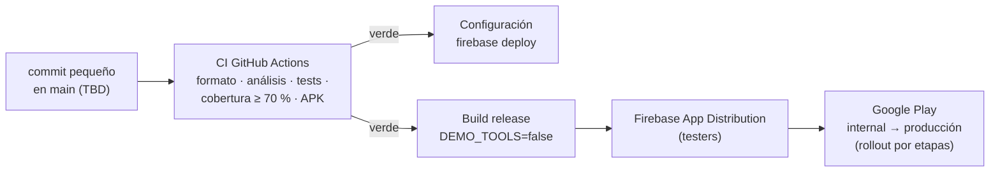

# Despliegue y operación

Cómo se publica, cómo se monitorea en producción, cómo se comporta ante fallos y qué hacer
cuando algo se rompe. Configuración inicial: [quickstart.md](../specs/001-digital-banking-mvp/quickstart.md).

## 1. Despliegue

### Flujo



### Configuración como código (`firebase/`)

Reglas, índices y la plantilla de Remote Config están versionados y se despliegan con la CLI:

```powershell
firebase deploy --only firestore:rules,firestore:indexes,remoteconfig
```

- La fuente de verdad del contenido es `assets/config/remote_config_defaults.json` (también
  son los valores por defecto que trae la app). `dart run tool/generate_remote_config_template.dart`
  genera a partir de él `firebase/remoteconfig.template.json`, así la app y la consola parten
  de los mismos valores.
- Cambios urgentes de contenido (layouts, ofertas, flags) pueden hacerse en la consola, pero
  deben llevarse luego al JSON del repositorio. Remote Config guarda el historial de
  versiones y permite volver a una anterior en un clic.
- Las reglas de Firestore solo se cambian desde el repositorio.

### Binario

```powershell
flutter build apk --release --dart-define-from-file=.env   # .env con DEMO_TOOLS=false
```

- Distribución gratuita a testers: **Firebase App Distribution** (`firebase appdistribution:distribute`).
- Producción: Google Play con *staged rollout* (5 % → 20 % → 100 %), vigilando Crashlytics
  entre etapas.
- `DEMO_TOOLS=false` en release: el simulador de fallos queda sin efecto (`NoFaults`) y su
  ruta no existe.
- CI reconstruye `.env` y `google-services.json` desde los secrets `FIREBASE_ENV` y
  `GOOGLE_SERVICES_JSON`; ninguna credencial está en el repositorio.

## 2. Monitoreo en producción

| Herramienta | Qué mide | Cómo se usa |
|---|---|---|
| **Crashlytics** | Crashes y errores no fatales (`Failure.unknown`/`server`) | Alertas de *velocity* (un crash que crece rápido) por correo; tasa de usuarios sin crashes por versión antes de ampliar un rollout |
| **Analytics** | Eventos del [catálogo](../specs/001-digital-banking-mvp/contracts/analytics-events.md), sin PII | Embudos y tendencias; *DebugView* para verificar eventos en desarrollo |
| **Remote Config** | Versiones publicadas | Historial y rollback de cambios de contenido |
| **Consola de Firestore / Auth** | Uso de cuotas, errores de reglas | Uso diario frente a los límites del plan |

Los logs locales (`AppLogger`) son estructurados y **redactan PII** (correos, montos, números,
tokens). Lo mismo aplica a los parámetros de eventos.

## 3. Detección de problemas

### Operativos

| Señal | Evento / fuente | Lectura |
|---|---|---|
| El servicio de divisas cae | `fx_service_failure` por `reason` | Pico de `timeout`/`http_5xx`: problema del proveedor; `invalid`: cambió su contrato |
| Firestore no responde | `data_load_error` (`feature`, `reason`) y `stale_data_shown` | Muchos clientes viendo datos de caché a la vez |
| Contenido mal publicado | `sdui_section_skipped` (`section_type`, `reason`) | Un tipo inexistente o un JSON inválido en Remote Config |
| Crash nuevo tras una versión | Crashlytics velocity | Detener el rollout |
| Push sin abrir | `push_opened` por `type` vs. envíos | Mensajes poco relevantes o deep links rotos |

### De experiencia de usuario

| Pregunta | Cómo se responde |
|---|---|
| ¿Dónde abandonan el registro? | Embudo `onboarding_step_viewed` → `onboarding_completed`, con `onboarding_abandoned.last_step` |
| ¿Falla el login por credenciales o por red? | `login_failure.reason` |
| ¿Los clientes ven datos viejos con frecuencia? | `stale_data_shown` por `feature` frente a sesiones |
| ¿La personalización funciona? | `feature_flag_evaluated` y `segment` como user property |
| ¿La red de los clientes es mala? | `connectivity_changed.online` |
| ¿Cierran sesión por inactividad sin querer? | `session_timeout` |

Siguiente paso: Firebase Performance Monitoring para tiempos de carga y latencia de red
reales por pantalla (fuera del alcance del MVP).

## 4. Comportamiento ante condiciones degradadas

Se demuestra en vivo con el **simulador de fallos** (Perfil → Simulador de fallos; requiere
`DEMO_TOOLS=true` y el flag `demo_fault_panel`). Ver [ADR-005](adr/005-resilience-fault-injection.md).

| Condición | Cuentas y movimientos | Inicio personalizado | Divisas |
|---|---|---|---|
| **Sin conexión** | Banner global; saldos y movimientos de caché con su hora; se actualiza solo al volver la red | Último layout conocido o defaults locales | Tasas guardadas con aviso; si no hay, error con "Reintentar" |
| **Alta latencia** | Skeletons, sin pantallas en blanco | Skeleton del inicio | Skeleton; timeout configurable (8 s) |
| **Servicio caído** | Como el SDK ante `unavailable`: caché con aviso y reconexión automática | Se mantiene el último layout | 3 reintentos con backoff, luego caché con aviso o error |
| **Caché vacía + servidor callado** | Tras 5 s, error con "Reintentar"; la escucha sigue | Defaults locales | Error con "Reintentar" |
| **Push no disponible** (sin Play Services) | La app funciona igual; se registra un warning | — | — |

Ninguna falla de un servicio impide usar los demás (indisponibilidad parcial).

## 5. Runbook de incidentes

| Síntoma | Diagnóstico | Acción |
|---|---|---|
| Pico de `fx_service_failure` | `reason` en Analytics; probar la API con `curl` | Si el proveedor cayó: los clientes ven caché. Si es prolongado, cambiar `fx_config.baseUrl` al proveedor alterno o apagar el flag `fx_service` |
| El inicio se ve vacío o incompleto | `sdui_section_skipped`; historial de Remote Config | Volver a la versión anterior de Remote Config |
| Una funcionalidad causa errores | Crashlytics por pantalla | Apagar su flag en `feature_flags` (aplica en segundos, sin publicar) |
| Crash en una versión nueva | Crashlytics velocity | Detener el rollout en Play; corregir y publicar |
| Clientes sin push | Errores en logs (`FCM Registration failed`); tokens en `devices/` | Verificar Play Services del dispositivo y la configuración de FCM |
| Permisos denegados en Firestore | `data_load_error` con `unauthorized` | Revisar el último despliegue de reglas; volver a la versión anterior desde el repo |
| Se acerca la cuota del plan | Uso en la consola | Revisar listeners duplicados; pasar a Blaze con alertas de presupuesto |

## 6. Riesgos conocidos

- La configuración puede editarse en la consola y desincronizarse del repositorio.
- La caché no caduca por antigüedad (se muestra la hora del dato).
- El E2E deja clientes de prueba (`e2e+<timestamp>@example.com`) en el proyecto de desarrollo.
- Algunas imágenes de emulador recientes (API 36+) no completan el registro de Play
  Services y no reciben push; en API 33 con Google Play y en dispositivos físicos funciona.
- `flutter run` puede quedarse en el splash si lee una dirección vieja del log del
  emulador: `adb logcat -c` y `adb forward --remove-all` lo resuelven.
